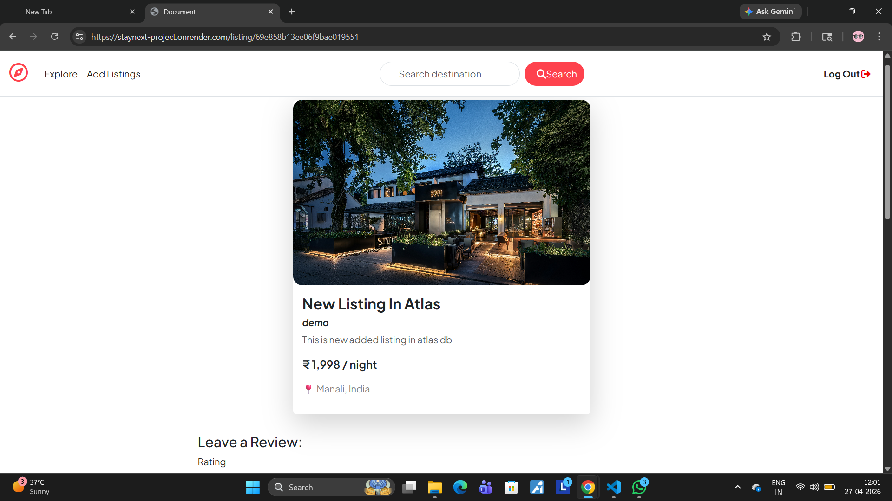

# 🏡 StayNext – Property Booking Platform

StayNext is a full-stack web application inspired by Airbnb that allows users to explore and book property listings with real-time features and modern UI.

---

## 🚀 Features

- 🔐 User Authentication (Sessions & Cookies)
- 🏠 Create, Edit, Delete Listings
- 📅 Date-based Availability (Booking System)
- ⭐ Ratings & Reviews System
- 🗺️ Map Integration (Location Visualization)
- ☁️ Image Upload using Cloudinary
- 🧠 MVC Architecture
- 🌐 Fully Deployed (MongoDB Atlas + Render)

---

## 🛠️ Tech Stack

### Frontend
- HTML
- CSS
- JavaScript
- Bootstrap
- EJS (Server-side rendering)

### Backend
- Node.js
- Express.js

### Database
- MongoDB (MongoDB Atlas)

### Other Tools & Services
- Cloudinary (Image Upload)
- Map API (Location Services)
- Render (Deployment)

---

## 🌐 Live Demo

👉 [https://staynext-2.onrender.com](https://staynext-2.onrender.com)

---

## 📸 Screenshots

###  Home Page


###  Review Results


###  Listing Details


###  Add Listing


---

## ⚙️ Installation & Setup

```bash
# Clone the repository
git clone https://github.com/shubhamkumbhar1218/staynext

# Navigate to project folder
cd staynext

# Install dependencies
npm install

# Run the application
npm start
